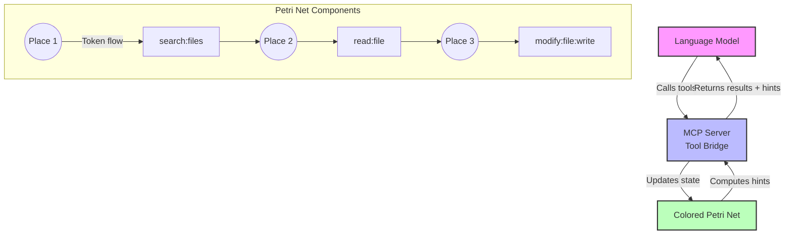
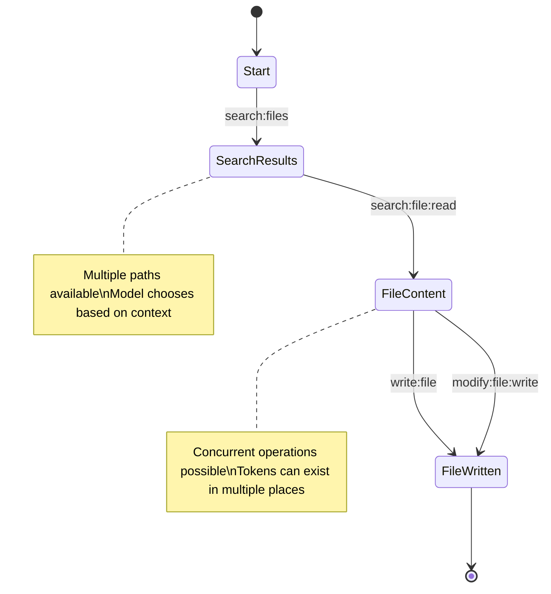

# Colored Petri Net for MCP Tool Orchestration

A formal approach to agent prompt flow control that embraces the inherent creativity and diversity of language models by presenting tools as an attractive field of possibilities rather than rigid pathways.

## The Philosophy: APIs as Interpretative Landscapes

### The Reality of Modern APIs

APIs in the wild rarely follow consistent design principles. They emerge from various sources:

1. **Graph APIs** - Often lack logical traversal patterns, reflecting organic growth
2. **Internal State Reflections** - Endpoints that mirror internal application architecture
3. **Organizational Artifacts** - APIs exposed based on departmental boundaries or historical decisions
4. **Utility Collections** - Endpoints added ad-hoc as needs arise

Agent architectures that force these disparate endpoints into rigid state machines create friction between how APIs actually exist and how agents try to use them.

### The Colored Petri Net Advantage

Instead of forcing linear paths through API chaos, colored Petri nets create an **attractive field** where:

- **Different models find different paths** - Each LLM's training biases become features, not bugs
- **Creativity emerges from constraint** - The net provides structure while allowing stochastic exploration
- **Tools combine naturally** - Verb:noun:verb patterns enable creative tool composition
- **Context flows freely** - Tokens carry state through the net without rigid schemas

## Core Innovation: Embracing Model Diversity

Different language models have different:
- **Training biases** - What they've seen shapes their preferences
- **Architectural capabilities** - Some excel at planning, others at execution
- **Stochastic tendencies** - Their "creativity" in approaching problems

The colored Petri net approach turns this diversity into a strength by:

1. **Presenting all valid transitions** - Models choose based on their internal logic
2. **Weighting paths with confidence scores** - Gentle guidance without forcing
3. **Allowing novel combinations** - Unexpected tool sequences can emerge
4. **Learning from choices** - Patterns can be analyzed to improve the net

## Technical Foundation

### Why Colored Petri Nets?

Workflow systems that model everything as single-state machines fail at scale. Real work is concurrent:

```
FSM Reality:                    Petri Net Reality:
State = "ReviewingTask"         Token1 @ Review
                               Token2 @ Implementation  
                               Token3 @ Testing
                               Token4 @ Documentation
```

### The Architecture



## Core Components

### 1. Colored Petri Net (`colored-petri-net.ts`)
The foundational data structure that creates an attractive field for AI navigation:
- **Token Management** - Colored tokens carry rich context through the net
- **Transition Discovery** - Computes all valid next actions, not just one
- **Confidence Scoring** - Weights transitions based on context and history
- **Pattern Matching** - Input arcs can filter tokens based on their color/data
- **Expression Evaluation** - Output arcs transform tokens as they flow

### 2. Semantic Hint Generation
The system doesn't dictate paths; it reveals possibilities:
```typescript
interface SemanticHint {
  transitionName: string;      // verb:noun or verb:noun:verb
  confidence: number;          // 0-1, how attractive this option is
  requiredTokens?: string[];   // What context is needed
  example?: string;           // How to invoke it
}
```

Different models will weight these hints differently based on their training and current context.

### 3. MCP Server Integration (`mcp-petri-net-server.ts`)
Bridges the mathematical model with practical tool use:
- **Dynamic Tool Prioritization** - Tools reorder based on workflow state
- **Context Preservation** - Tokens flow between tool calls
- **Emergent Workflows** - No predefined paths, just possibilities
- **Model-Agnostic** - Works with any MCP-compatible LLM

## Tool Naming Convention: Semantic Composability

The verb:noun:verb pattern isn't just naming—it's semantic composition:

### Simple Tools (verb:noun)
- `search:files` - Atomic action on a resource
- `read:file` - Direct operation
- `validate:schema` - Single-step process

### Composite Tools (verb:noun:verb)
- `search:file:read` - Workflow compression
- `modify:file:write` - Transactional operation
- `analyze:code:refactor` - Complex workflow as single transition

This pattern allows models to:
1. **Choose granularity** - Use atomic or composite tools based on confidence
2. **Create novel combinations** - Patterns can emerge that weren't explicitly programmed
3. **Express intent clearly** - The semantic structure guides proper usage

## Usage

### Installation
```bash
npm install
npm run build
```

### Run the Demo
```bash
npm run demo
```

This shows how the Petri net tracks state and suggests next actions.

### Start the MCP Server
```bash
npm start
```

The server can then be connected to any MCP-compatible AI system.

### Development
```bash
npm run dev  # Run with ts-node
npm test     # Run tests
npm run lint # Lint code
```

## Example Workflow



## Real-World Applications

### 1. API Integration Mapping
Map disparate API endpoints into a coherent workflow space:
```typescript
// API endpoints become transitions
addTransition({
  name: 'fetch:user:profile',
  handler: async (token) => {
    // Maps to GET /api/v2/users/{id}/profile
    // or GraphQL query { user(id) { profile } }
    // or REST endpoint /legacy/getUserInfo
  }
});
```

### 2. Multi-Model Orchestration
Different models navigate the same net differently:
- **GPT-4**: Might prefer compositional tools (verb:noun:verb)
- **Claude**: Might chain atomic operations
- **Specialized models**: Follow domain-specific paths

### 3. Emergent Workflow Discovery
The net reveals patterns in how models solve problems:
```typescript
// Track transition sequences
const patterns = analyzer.findCommonPaths();
// Discover that 90% of file edits follow: search → read → modify → write
// But 10% use creative alternatives: search → analyze → regenerate
```

## Advanced Patterns

### Conditional Transitions
Use guards to create context-aware workflows:
```typescript
addTransition({
  name: 'deploy:code:production',
  guard: (binding) => {
    return binding.tests_passed && 
           binding.review_approved && 
           binding.user_role === 'deployer';
  }
});
```

### Token Transformation
Colors (data) transform as tokens flow:
```typescript
addArc({
  source: 'code_analyzed',
  target: 'generate:refactor:plan',
  expression: (token) => ({
    ...token,
    suggestions: analyzeCodeQuality(token.ast),
    complexity: calculateCyclomaticComplexity(token.ast)
  })
});
```

### Hierarchical Nets
Compose smaller nets into larger workflows:
```typescript
const authNet = createAuthWorkflow();
const dataNet = createDataProcessingWorkflow();
const apiNet = composeNets(authNet, dataNet, {
  bridges: [
    { from: 'auth.token_acquired', to: 'data.api_ready' }
  ]
});
```

## Implementation Best Practices

### 1. Design for Concurrency
```typescript
// Places should represent concurrent states
addPlace({ id: 'files_processing', name: 'Files Being Processed' });
addPlace({ id: 'api_calls_pending', name: 'Pending API Calls' });
addPlace({ id: 'results_aggregating', name: 'Aggregating Results' });
```

### 2. Semantic Tool Naming
```typescript
// Good: Clear verb:noun:verb pattern
'validate:schema:fix'
'analyze:performance:optimize'

// Avoid: Ambiguous or procedural names
'processData'
'handleRequest'
```

### 3. Rich Token Context
```typescript
interface WorkflowToken {
  id: string;
  timestamp: number;
  source: 'user' | 'system' | 'api';
  data: any;
  history: TransitionHistory[];
  metadata: Record<string, any>;
}
```

## Scaling Considerations

### For Large APIs
- **Lazy Loading**: Load transitions on demand
- **Clustering**: Group related transitions
- **Caching**: Cache enabled transition calculations
- **Sharding**: Distribute net across services

### For Multiple Models
- **Model Profiles**: Track preferences per model
- **A/B Testing**: Compare path efficiencies
- **Adaptation**: Adjust confidence scores dynamically

## Theory and Practice

The approach builds on established Petri net theory while addressing practical AI agent needs:

1. **Formal Foundation**: Mathematical proofs of correctness possible
2. **Practical Flexibility**: Handles messy real-world APIs
3. **Model Diversity**: Embraces different AI capabilities
4. **Emergent Behavior**: Enables creative problem-solving

## Getting Started with Your Own Implementation

### 1. Define Your Domain
Start by mapping your API or tool landscape:
```typescript
// Identify your places (states)
const places = [
  'data_needed',
  'data_fetched', 
  'data_validated',
  'data_processed'
];

// Map your tools to transitions
const transitions = [
  { name: 'fetch:data', from: 'data_needed', to: 'data_fetched' },
  { name: 'validate:data', from: 'data_fetched', to: 'data_validated' },
  { name: 'process:data:save', from: 'data_validated', to: 'data_processed' }
];
```

### 2. Add Domain Logic
Implement guards and expressions for your specific needs:
```typescript
net.addTransition({
  name: 'approve:document',
  guard: (binding) => binding.document_token.status === 'pending_review',
  handler: async (binding) => {
    const result = await documentAPI.approve(binding.document_token.id);
    return { ...binding.document_token, status: 'approved', approver: binding.user };
  }
});
```

### 3. Connect to MCP
Wire your net to the Model Context Protocol:
```typescript
const server = new MCPPetriNetServer();
server.loadNet(yourCustomNet);
await server.start();
```

## Troubleshooting

### Common Issues

**"No enabled transitions"**
- Check that tokens exist in places
- Verify guard conditions
- Ensure arcs are properly connected

**"State explosion"**
- Use hierarchical nets for complex workflows
- Consider token attributes instead of separate places
- Group similar states

**"Poor model performance"**
- Adjust confidence scoring algorithms
- Provide richer semantic hints
- Consider model-specific adaptations

## Resources

- [Petri Net Theory](https://www.informatik.uni-hamburg.de/TGI/PetriNets/)
- [Model Context Protocol](https://modelcontextprotocol.io/)
- [Example Implementations](./examples/)

## Contributing

We welcome contributions that:
- Add new workflow patterns
- Improve semantic hint generation
- Extend to new domains
- Enhance model compatibility

Please include tests and documentation with your contributions.

## License

MIT